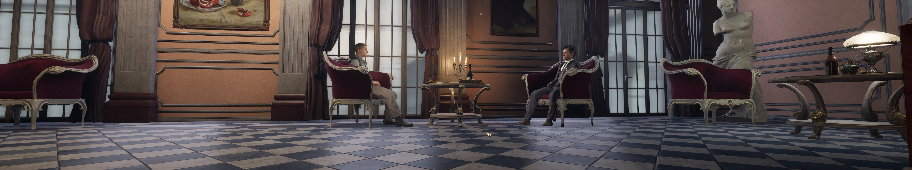

## Sherlock Holmes Chapter One ultrawide and wider

The tool removes the side black bars from the game seen at 21:9 and wider resolutions. Compared to the alternative and creative [solution](https://github.com/PhantomGamers/shco-wsf) by PhantomGamers, it covers all scenes, including the menu and dialogue, and adjusts the field of view of each to vertically match 16:9. It supports all aspect ratios and also allows to control the field of view in real time.

1. [Download](/../../releases) and unpack the archive.
2. Launch the game first, followed by the tool.
3. Press the hotkeys as shown to toggle the desired effects.

All trainers based on CE components may trigger some anti-virus software.

Tested on the latest GOG version at 2560x1080, 5760x1080 and 11520x1080.

You can buy me a [coffee](https://ko-fi.com/rozziroxx) or become a [patron](https://www.patreon.com/rozzi).

### Credits
The field of view calculation formula implementation was inspired by killer-m's work.
